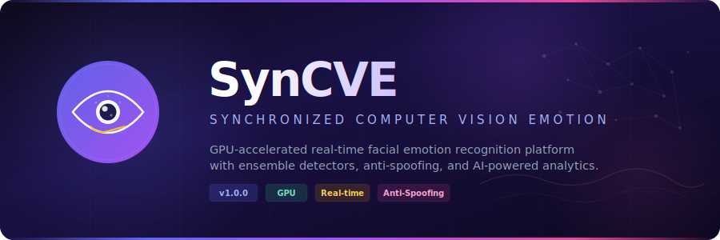
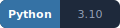
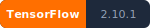
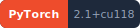
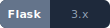
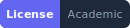
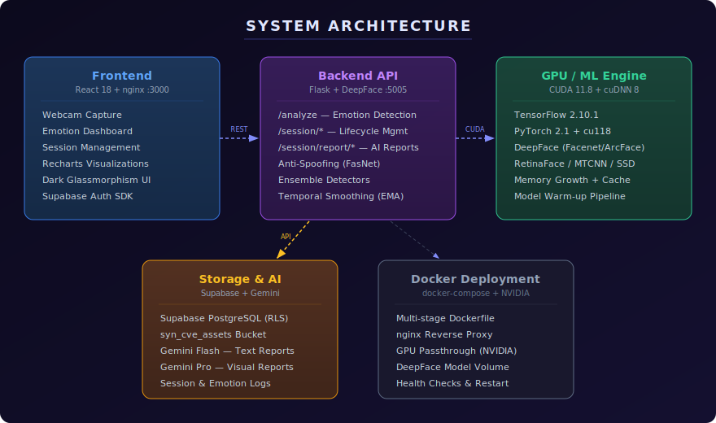

<p align="center">
  
</p>

<p align="center">
  
  
  
  
  
  
  
  
  
</p>

<p align="center">
  <b>GPU-accelerated real-time emotion recognition</b> with DeepFace ensemble detectors,<br/>
  anti-spoofing guard rails, temporal smoothing, and Gemini AI-powered reports.
</p>

---

## Overview

SynCVE (**Syn**chronized **C**omputer **V**ision **E**motion) is a research-ready platform that fuses **DeepFace** vision intelligence with a modern **React** frontend and a GPU-first **Flask** API backend. Built for continuous webcam feeds, it delivers sub-2-second inference latency with anti-spoofing protection, configurable ensemble detectors, and AI-generated emotion analysis reports.

### Highlights

| | Feature | Details |
|---|---|---|
| **👁** | **Ensemble Detection** | OpenCV + SSD weighted fusion with configurable fallback to RetinaFace / MTCNN |
| **🛡** | **Anti-Spoofing** | FasNet (TensorFlow/PyTorch hybrid) guard rails for live demos |
| **⚡** | **GPU-First** | CUDA 11.8, TF memory growth, model cache management, warmup pipeline |
| **📊** | **Temporal Analysis** | EMA smoothing (α=0.2), transition detection, volatility windows |
| **🤖** | **AI Reports** | Two-stage Gemini pipeline — Flash for text, Pro for visual dashboards |
| **🎨** | **Modern UI** | Dark glassmorphism React 18 SPA with Recharts emotion visualizations |
| **☁** | **Cloud Storage** | Supabase PostgreSQL + object storage for sessions, logs, and keyframes |
| **🐳** | **Dockerized** | Multi-stage build with NVIDIA GPU passthrough and nginx reverse proxy |

---

## Architecture

<p align="center">
  
</p>

### Backend — `src/backend/` · Flask + DeepFace · Port 5005

| Module | Responsibility |
|---|---|
| `app.py` | Flask bootstrap, GPU config, model warmup, rate limiting, CORS |
| `routes.py` | REST endpoints (`/analyze`, `/session/*`, `/health`, `/represent`, `/verify`) |
| `service.py` | DeepFace wrapper with GPU cleanup and model cache limiting |
| `emotion_analytics.py` | Score aggregation, noise filtering, emotion statistics |
| `temporal_analysis.py` | EMA smoothing, transition detection, volatility tracking |
| `gemini_client.py` | Two-stage AI report generation (text + visual) |
| `session_manager.py` | Session lifecycle — start, pause, stop, history, reports |
| `storage.py` | Supabase integration — PostgreSQL queries, bucket uploads |
| `gpu_utils.py` | TensorFlow/PyTorch memory management, garbage collection |

### Frontend — `src/frontend/` · React 18 + nginx · Port 3000

- Webcam capture with configurable detection intervals
- Real-time emotion dashboard with **Recharts** visualizations
- Session management (start/pause/stop with report generation)
- Dark-theme glassmorphism design
- Supabase SDK for auth and data access

### Docker — Multi-stage Build

```
Dockerfile
├── backend-base    NVIDIA CUDA 11.8 + Python 3.10 + ML stack
├── frontend-build  Node 18 Alpine → React production bundle
├── frontend        nginx Alpine → serves SPA + reverse proxy
└── eval            Extends backend-base for benchmarks
```

```
docker/
└── nginx.conf      SPA routing + /analyze & /session proxy to backend:5005
```

> **Why this layout?** `Dockerfile`, `docker-compose.yml`, and `.dockerignore` live at the **project root** — this is the Docker standard so the build context includes all source files. The `docker/` subfolder holds **supporting configs** (nginx.conf) that are copied into containers during build, keeping the root clean.

---

## Quick Start

### Prerequisites

- **NVIDIA GPU** with 6+ GB VRAM and driver ≥ 522.06
- **CUDA 11.8** + **cuDNN 8.6**
- **Conda** (Anaconda or Miniconda)
- **Node.js 16+**
- **Docker Engine 24+** with NVIDIA Container Toolkit *(for containerized deployment)*

### Option A — Local Development

```bash
# 1. Clone and enter project
git clone <repo-url> && cd SynCVE

# 2. Create conda environment
conda create -n SynCVE python=3.10 -y
conda activate SynCVE

# 3. Install dependencies
pip install -r requirements.txt
cd src/frontend && npm install && cd ../..

# 4. Configure environment
cp .env.example .env
# Edit .env with your GEMINI_API_KEY, SUPABASE_URL, SUPABASE_KEY

# 5. Verify GPU
python -c "import tensorflow as tf; print(tf.config.list_physical_devices('GPU'))"
python -c "import torch; print(torch.cuda.is_available())"
```

**Start services:**

```bash
# Terminal 1 — Backend
conda activate SynCVE && python src/backend/app.py

# Terminal 2 — Frontend
cd src/frontend && npm start
```

Or use the Windows batch scripts:

```
scripts\setup.bat             # First-time setup (one-click)
scripts\start_backend.bat     # Launch Flask backend
scripts\start_frontend.bat    # Launch React dev server
scripts\stop_service.bat      # Graceful shutdown + port cleanup
```

### Option B — Docker Compose

```bash
# 1. Configure
cp .env.example .env   # fill in secrets

# 2. Launch
docker compose up -d

# 3. Check health
curl http://localhost:5005/health

# 4. Open UI
# → http://localhost:3000
```

**Additional Docker commands:**

```bash
docker compose logs -f backend          # Tail backend logs
docker compose --profile eval run eval  # Run evaluation suite
docker compose down                     # Stop all services
```

---

## API Reference

| Endpoint | Method | Description |
|---|---|---|
| `/health` | GET | System health (DeepFace, Supabase, GPU status) |
| `/config` | GET | Non-secret runtime configuration |
| `/analyze` | POST | Emotion detection with ensemble + anti-spoofing |
| `/represent` | POST | Extract face embeddings (Facenet) |
| `/verify` | POST | Face verification (1:1 cosine comparison) |
| `/session/start` | POST | Start emotion tracking session |
| `/session/pause` | POST | Pause session + trigger visual report |
| `/session/stop` | POST | Stop session + generate final report |
| `/session/history` | GET | Recent sessions (filterable by `user_id`, `limit`) |
| `/session/<id>` | GET | Specific session details |
| `/session/report/emotion` | POST | Two-stage Gemini text report |
| `/session/report/visual` | POST | AI-generated visual dashboard image |

**Image input formats:** Base64 data-URI, multipart file upload

---

## Configuration

### `settings.yml` — Application Config

```yaml
server:
  host: "0.0.0.0"
  port: 5005
  cors_origins: ["http://localhost:3000"]

deepface:
  detector_backend: "opencv"
  model_name: "Facenet"
  anti_spoofing: true
  ensemble:
    enabled: true
    detectors: ["opencv", "ssd"]
    weights: { opencv: 0.60, ssd: 0.40 }

gpu:
  cuda_visible_devices: "0"      # "-1" for CPU
  tf_memory_fraction: 0.8
  tf_allow_growth: true

temporal:
  ema_alpha: 0.2                 # Smoothing factor
  transition_threshold: 0.15
  volatility_window: 10

gemini:
  text_model: "gemini-2.5-flash"
  image_model: "gemini-2.5-flash-image"

report:
  mode: "fast"                   # "fast" = JSON, "full" = JSON + AI image
  noise_floor: 0.0
  keyframe_limit: 4
```

### `.env` — Secrets (gitignored)

```ini
GEMINI_API_KEY=your_key
SUPABASE_URL=https://your-project.supabase.co
SUPABASE_KEY=your_anon_key
REACT_APP_SERVICE_ENDPOINT=http://localhost:5005
REACT_APP_SUPABASE_URL=https://your-project.supabase.co
REACT_APP_SUPABASE_ANON_KEY=your_anon_key
```

---

## GPU & Performance

| Tunable | Default | Notes |
|---|---|---|
| `CUDA_VISIBLE_DEVICES` | `0` | Set `-1` for CPU fallback |
| `TF_GPU_MEMORY_FRACTION` | `0.8` | Lower if sharing GPU with other apps |
| `TF_FORCE_GPU_ALLOW_GROWTH` | `true` | Prevents OOM from pre-allocating all VRAM |
| `OMP_NUM_THREADS` | `12` | CPU parallelism for non-GPU ops |
| `ANTI_SPOOFING` | `1` | Adds ~500ms/frame — set `0` if latency critical |

**Warmup:** First API call takes 5–15s while models load. Subsequent calls settle to ~1–2s.

---

## Testing

```bash
# Full test suite
scripts\run_tests.bat

# Or directly with pytest
conda activate SynCVE
pytest tests/ -v --tb=short

# Health check (dependency verification)
python scripts/health_check.py
```

Test structure:
```
tests/
├── unit/          # Core logic tests
├── integration/   # API endpoint tests
├── e2e/           # Full pipeline tests
├── regression/    # Bug regression tests
└── artifacts/     # Generated test images/videos
```

---

## Evaluation & Benchmarking

```bash
# Via Docker (recommended)
docker compose --profile eval run eval

# Locally
conda activate SynCVE
python eval/benchmark.py --config eval/configs/default.yml
```

Evaluation results are written to `eval/results/` and include accuracy metrics, latency benchmarks, and ablation study outputs.

---

## Troubleshooting

| Symptom | Check | Fix |
|---|---|---|
| Backend won't start | `python src/backend/app.py` | Reinstall deps: `pip install -r requirements.txt` |
| GPU not detected | `nvidia-smi` | Install CUDA 11.8, driver ≥ 522.06 |
| Port 5005 busy | `netstat -ano \| findstr ":5005"` | `scripts\stop_service.bat` or `taskkill /PID <pid> /F` |
| Frontend can't reach backend | Check `REACT_APP_SERVICE_ENDPOINT` | Must match backend host:port |
| TensorFlow OOM | Lower `TF_GPU_MEMORY_FRACTION` | Restart app to reset GPU memory |
| Anti-spoofing errors | Check FasNet deps | Disable with `ANTI_SPOOFING=0` |

---

## Project Structure

```
SynCVE/
├── src/
│   ├── backend/            # Flask API + emotion detection
│   │   ├── app.py          # Bootstrap, GPU config, warmup
│   │   ├── routes.py       # REST endpoints
│   │   ├── service.py      # DeepFace wrapper
│   │   └── ...             # Analytics, sessions, storage
│   └── frontend/           # React 18 SPA
│       ├── src/            # Components, hooks, styles
│       └── public/         # Static assets + favicon
├── eval/                   # Benchmarks & ablation studies
├── tests/                  # Unit, integration, e2e, regression
├── scripts/                # Setup, start, stop, test scripts
├── docker/                 # nginx.conf (container support)
├── assets/                 # SVG logos, badges, diagrams
├── Dockerfile              # Multi-stage build (GPU + React + eval)
├── docker-compose.yml      # Service orchestration
├── .dockerignore           # Build context exclusions
├── settings.yml            # Application configuration
├── requirements.txt        # Python dependencies
├── environment.yml         # Conda environment spec
└── .env.example            # Environment variable template
```

---

## Documentation

Additional docs are available in `dev/docs/`:

- **Quick Start Guide** — Step-by-step bootstrap
- **Frontend Redesign Summary** — UI decisions and architecture
- **Loading Optimization** — Performance tuning insights
- **GPU Troubleshooting** — CUDA/PyTorch deep dive
- **Google Auth Integration** — Authentication setup
- **Anti-Spoofing Fixes** — FasNet integration details

---

## License

This is an academic research project. It uses open-source frameworks — [DeepFace](https://github.com/serengil/deepface), [TensorFlow](https://www.tensorflow.org/), [PyTorch](https://pytorch.org/), [React](https://react.dev/) — each under their respective licenses. Follow each dependency's license terms when deploying.

<p align="center">
  
  <br/>
  <sub>Built with research rigor and engineering craft.</sub>
</p>
