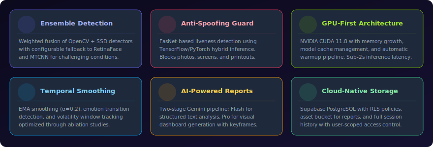
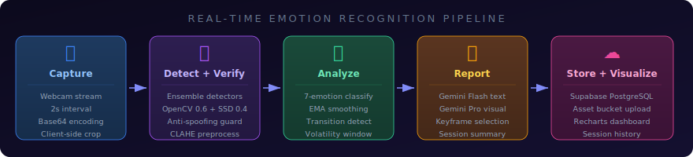
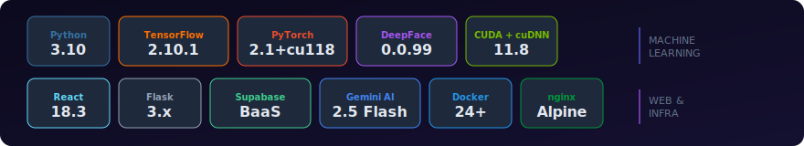
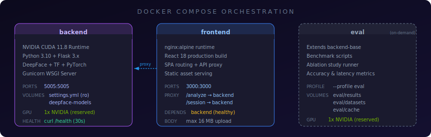

<p align="center">
  
</p>

<p align="center">
  <a href="#quick-start"></a>&nbsp;
  <a href="#api-reference"></a>&nbsp;
  <a href="#docker-deployment"></a>&nbsp;
  <a href="#evaluation--benchmarking"></a>
</p>

<p align="center">
  
  
  
  
  
  
  
  
  
</p>

---

## Table of Contents

- [Overview](#overview)
- [Key Features](#key-features)
- [Processing Pipeline](#processing-pipeline)
- [Tech Stack](#tech-stack)
- [System Architecture](#system-architecture)
- [Quick Start](#quick-start)
- [Docker Deployment](#docker-deployment)
- [API Reference](#api-reference)
- [Configuration](#configuration)
- [GPU & Performance Tuning](#gpu--performance-tuning)
- [Testing](#testing)
- [Evaluation & Benchmarking](#evaluation--benchmarking)
- [Project Structure](#project-structure)
- [Troubleshooting](#troubleshooting)
- [License](#license)

---

## Overview

**SynCVE** (*Synchronized Computer Vision Emotion*) is a research-grade platform for **real-time facial emotion recognition** built with a GPU-first architecture. It fuses state-of-the-art computer vision models with modern web technologies to deliver continuous emotion tracking from live webcam feeds.

The system implements a complete emotion analysis pipeline: from frame capture and face detection through ensemble classification, temporal smoothing, and AI-powered report generation — all within a production-ready containerized deployment.

### Research Contributions

| Contribution | Description |
|:---|:---|
| **Event-Level Change-Point Detection (Axis 1A)** | Multi-method consensus pipeline (sliding-window z-score · CUSUM · PELT) on the smoothed emotion-probability stream, emitting 50–200 ms-class affective events with `(from, to, magnitude, confidence, methods)`. See `src/backend/event_detector.py` and `eval/event_eval.py`. |
| **Uncertainty-Aware Ensemble Fusion (Axis 1C)** | Entropy-weighted softmax fusion replaces fixed 50/50 weighting; under-confident detectors are auto-down-weighted, with optional temperature scaling and cohort-prior blending. See `src/backend/uncertainty_fusion.py`. |
| **Clinical Metrics Module (Axis 1A applied)** | Valence trace, drift (with bootstrap 95% CI), Affect Blunting Score, Reactivity, Reaction Latency, Suppression Index, Incongruence (Phase 2 ASR), per-detector reliability — formulas in `docs/clinical_metrics.md`. |
| **Clinical Report Exporter (Axis 4)** | Markdown + PDF (reportlab) clinician-readable report with Top-K event ranking, metric block, reaction-latency table, ethics disclaimer. See `src/backend/clinical_report.py`. |
| **Three-Track Timeline UI (Axis 4)** | Time-aligned emotion-probability stack + clickable event-marker lane + ASR transcript lane, plus a live sensitivity panel that re-runs detection over `/session/<id>/events` without restarting capture. See `src/frontend/src/components/TimelineView.jsx`. |
| **Ensemble Detector Fusion (legacy)** | Weighted combination of RetinaFace + MTCNN (configurable) face detectors for robust face detection across lighting conditions. |
| **Anti-Spoofing Integration** | FasNet-based liveness detection using TensorFlow/PyTorch hybrid inference to reject photos, screens, and printouts in real-time. |
| **Temporal Emotion Smoothing** | EMA-based smoothing (alpha=0.2) with transition detection and volatility tracking, parameters optimised through systematic ablation studies. |
| **Two-Stage AI Reporting** | Gemini Flash for structured text analysis + Gemini Pro for visual dashboard generation with automatic keyframe selection. |


## Key Features

<p align="center">
  
</p>


## Processing Pipeline

<p align="center">
  
</p>

The pipeline processes webcam frames at configurable intervals (default 2s), running each frame through face detection, anti-spoofing verification, 7-class emotion classification, temporal smoothing, and optional AI report generation. End-to-end latency is **~1–2 seconds** after model warmup.


## Tech Stack

<p align="center">
  
</p>

<details>
<summary><b>Full Dependency Breakdown</b></summary>

| Layer | Technology | Version | Purpose |
|:---|:---|:---|:---|
| **ML Framework** | TensorFlow | 2.10.1 | DeepFace emotion models, FasNet anti-spoofing |
| **ML Framework** | PyTorch | 2.1+cu118 | RetinaFace detector, auxiliary models |
| **Face Analysis** | DeepFace | 0.0.99+ | Emotion classification, face embedding, verification |
| **Face Detectors** | OpenCV, SSD, RetinaFace, MTCNN | Various | Ensemble face detection with weighted fusion |
| **GPU Runtime** | NVIDIA CUDA + cuDNN | 11.8 / 8.6 | GPU acceleration for all inference operations |
| **Web Backend** | Flask + Gunicorn | 3.x / 21.2 | REST API server with rate limiting and CORS |
| **Web Frontend** | React + Recharts | 18.3 / 3.8 | SPA with real-time emotion visualizations |
| **Reverse Proxy** | nginx | Alpine | SPA routing, API proxy, static asset serving |
| **AI Reports** | Google Gemini | 2.5 Flash | Text analysis and visual dashboard generation |
| **Cloud Storage** | Supabase | 2.5+ | PostgreSQL, object storage, auth SDK |
| **Validation** | Pydantic | 2.x | Request/response schema validation |
| **Containerization** | Docker Compose | 24+ | Multi-service orchestration with GPU passthrough |

</details>


## System Architecture

<p align="center">
  
</p>

### Backend — `src/backend/` &middot; Flask + DeepFace &middot; Port 5005

| Module | Responsibility |
|:---|:---|
| `app.py` | Flask bootstrap, GPU config, model warmup, rate limiting, CORS |
| `routes.py` | REST endpoints — `/analyze`, `/session/*`, `/events`, `/clinical_metrics`, `/clinical_report` |
| `service.py` | DeepFace wrapper with GPU memory cleanup and model cache limiting |
| `emotion_analytics.py` | Score aggregation, noise filtering, emotion statistics |
| `temporal_analysis.py` | EMA smoothing, transition detection, volatility tracking, **event detector hook** |
| `event_detector.py` | **Axis 1A** — sliding-window / CUSUM / PELT consensus event detection |
| `uncertainty_fusion.py` | **Axis 1C** — entropy-weighted softmax fusion (replaces 50/50) |
| `clinical_metrics.py` | **Axis 1A applied** — valence, drift, blunting, reactivity, suppression, incongruence |
| `clinical_report.py` | Markdown / PDF clinical-report exporter (reportlab) |
| `gemini_client.py` | Vertex AI Express + AI Studio routing; text + image generation with retry |
| `session_manager.py` | Session lifecycle — start, pause, stop, history, reports, events, clinical metrics |
| `storage.py` | Supabase integration — PostgreSQL queries, bucket uploads |
| `gpu_utils.py` | TensorFlow/PyTorch memory management, garbage collection |

### Frontend — `src/frontend/` &middot; React 18 + nginx &middot; Port 3000

| Component | Description |
|:---|:---|
| Webcam Capture | Configurable interval frame capture with client-side crop |
| Emotion Dashboard | Real-time probability bars and dominant emotion display |
| Session Timeline | Recharts-based temporal emotion visualisations |
| **`TimelineView.jsx`** | **Axis 4** — three-track time-aligned view (emotion stack + event markers + ASR chips) |
| **`EventSensitivityPanel.jsx`** | **Axis 4** — live z-threshold / Δp / consensus sliders re-driving `/session/<id>/events` |
| Clinical Metrics Block | Valence, drift, ABS, reactivity, suppression, incongruence tiles in `SessionReport.jsx` |
| Clinical Report Download | Markdown + PDF buttons in `SessionReport.jsx` (`/session/<id>/clinical_report?format=md|pdf`) |
| Report Viewer | AI-generated text and visual report rendering |
| Session Manager | Start / pause / stop with history navigation |


## Quick Start

### Prerequisites

| Requirement | Minimum | Notes |
|:---|:---|:---|
| NVIDIA GPU | 6 GB VRAM | Driver ≥ 522.06 |
| CUDA Toolkit | 11.8 | With cuDNN 8.6 |
| Conda | Miniconda 3 | Or Anaconda |
| Node.js | 16+ | For frontend dev server |
| Docker Engine | 24+ | Only for containerized deployment |

### Option A — Local Development

```bash
# 1. Clone and enter project
git clone <repo-url> && cd SynCVE

# 2. Create conda environment
conda create -n SynCVE python=3.10 -y
conda activate SynCVE

# 3. Install Python dependencies
pip install -r requirements.txt

# 4. Install frontend dependencies
cd src/frontend && npm install && cd ../..

# 5. Configure environment
cp .env.example .env
# Edit .env → add your GEMINI_API_KEY, SUPABASE_URL, SUPABASE_KEY

# 6. Verify GPU availability
python -c "import tensorflow as tf; print('TF GPUs:', tf.config.list_physical_devices('GPU'))"
python -c "import torch; print('CUDA:', torch.cuda.is_available(), '| Device:', torch.cuda.get_device_name(0) if torch.cuda.is_available() else 'N/A')"
```

**Start services:**

```bash
# Terminal 1 — Backend (GPU-accelerated Flask API)
conda activate SynCVE && python src/backend/app.py

# Terminal 2 — Frontend (React dev server)
cd src/frontend && npm start
```

> **Windows users** — one-click batch scripts are available:
>
> | Script | Purpose |
> |:---|:---|
> | `scripts\setup.bat` | First-time environment setup |
> | `scripts\start_backend.bat` | Launch Flask backend |
> | `scripts\start_frontend.bat` | Launch React dev server |
> | `scripts\stop_service.bat` | Graceful shutdown + port cleanup |

### Option B — Docker Compose

```bash
# 1. Configure secrets
cp .env.example .env   # fill in API keys

# 2. Launch all services
docker compose up -d

# 3. Verify health
curl http://localhost:5005/health

# 4. Open UI → http://localhost:3000
```


## Docker Deployment

<p align="center">
  
</p>

### Multi-Stage Dockerfile

```
Dockerfile
├── backend-base    NVIDIA CUDA 11.8 + Python 3.10 + TF/PyTorch/DeepFace
├── frontend-build  Node 18 Alpine → React production bundle
├── frontend        nginx Alpine → serves SPA + reverse proxy to backend
└── eval            Extends backend-base → benchmark and ablation scripts
```

### File Layout Convention

| File | Location | Reason |
|:---|:---|:---|
| `Dockerfile` | Root | Docker standard — build context must include all source |
| `docker-compose.yml` | Root | Docker standard — orchestration entry point |
| `.dockerignore` | Root | Docker standard — controls build context |
| `nginx.conf` | `docker/` | Supporting config — copied into container at build time |

> Root-level Docker files follow the Docker convention where the build context (`.`) encompasses the entire project. The `docker/` subfolder holds auxiliary configs that are `COPY`'d into containers, keeping the root clean.

### Common Commands

```bash
docker compose up -d                       # Start backend + frontend
docker compose logs -f backend             # Tail backend logs
docker compose --profile eval run eval     # Run evaluation suite
docker compose down                        # Stop all services
docker compose build --no-cache backend    # Rebuild backend image
```


## API Reference

### Core Endpoints

| Endpoint | Method | Rate Limit | Description |
|:---|:---|:---|:---|
| `/health` | `GET` | 60/min | System health — DeepFace, Supabase, GPU status |
| `/config` | `GET` | 60/min | Non-secret runtime configuration |
| `/analyze` | `POST` | 30/min | Emotion detection with ensemble + anti-spoofing |
| `/represent` | `POST` | 60/min | Extract face embeddings (Facenet model) |
| `/verify` | `POST` | 60/min | Face verification — 1:1 cosine comparison |

### Session Endpoints

| Endpoint | Method | Rate Limit | Description |
|:---|:---|:---|:---|
| `/session/start` | `POST` | 60/min | Start emotion tracking session |
| `/session/pause` | `POST` | 60/min | Pause session + trigger visual report |
| `/session/stop` | `POST` | 60/min | Stop session + generate final report |
| `/session/history` | `GET` | 60/min | Recent sessions (filter by `user_id`, `limit`) |
| `/session/<id>` | `GET` | 60/min | Specific session details |
| `/session/<id>/events` | `GET` | 60/min | **Axis 1A** — re-run consensus event detector with overrides (`?method=&z_threshold=&min_magnitude=&consensus_min_methods=`) |
| `/session/<id>/clinical_metrics` | `POST` | 60/min | **Axis 1A** — valence trace, drift (CI), ABS, reactivity, suppression, incongruence; optional `triggers` + `asr_segments` body |
| `/session/<id>/clinical_report` | `GET` | 60/min | **Axis 4** — Markdown (`?format=md`) or PDF (`?format=pdf`) clinician report |
| `/session/report/emotion` | `POST` | 10/min | Two-stage Gemini text report |
| `/session/report/visual` | `POST` | 10/min | AI-generated visual dashboard image |

**Supported image input formats:** Base64 data-URI, multipart file upload (max 16 MB)


## Configuration

### `settings.yml` — Application Configuration

```yaml
server:
  host: "0.0.0.0"
  port: 5005
  cors_origins: ["http://localhost:3000"]

deepface:
  detector_backend: "opencv"           # Primary face detector
  model_name: "Facenet"                # Face embedding model
  anti_spoofing: true                  # FasNet liveness detection
  confidence_threshold: 0.1
  ensemble:
    enabled: true
    detectors: ["opencv", "ssd"]       # Weighted fusion pair
    weights: { opencv: 0.60, ssd: 0.40 }

gpu:
  cuda_visible_devices: "0"            # "-1" for CPU-only mode
  tf_memory_fraction: 0.8
  tf_allow_growth: true

temporal:
  ema_alpha: 0.2                       # Smoothing factor (ablation-optimized)
  transition_threshold: 0.15           # Min delta for emotion changes
  volatility_window: 10                # Std dev window size

# Axis 1A — change-point detection on the emotion-probability stream
events:
  enabled: true
  method: "ensemble"                   # "sliding" | "cusum" | "pelt" | "ensemble"
  consensus_min_methods: 2             # in "ensemble" mode, n methods must agree
  refractory_frames: 3
  sliding: { window: 5, z_threshold: 2.5, min_magnitude: 0.10 }
  cusum:   { drift: 0.005, threshold: 0.15 }
  pelt:    { model: "rbf", penalty: 3.0, min_size: 3 }

# Axis 1C — uncertainty-aware ensemble fusion (replaces fixed 50/50)
fusion:
  method: "uncertainty"                # "fixed" | "uncertainty" | "max_confidence"
  temperature: 1.0
  entropy_floor: 0.05
  blend_with_fixed: 0.0                # 0..1 blend with cohort-tuned weights

# Axis 1A applied — clinical metrics
clinical:
  enabled: true
  valence_map:                         # signed valence per emotion
    happy: 1.0
    surprise: 0.5
    neutral: 0.0
    fear: -0.7
    sad: -0.8
    disgust: -0.6
    angry: -0.9
  reaction_latency_max_sec: 3.0
  incongruence_window_sec: 2.0
  sigma_baseline: 0.30
  range_baseline: 1.20

gemini:
  text_model: "gemini-2.5-flash"       # Structured text reports
  image_model: "gemini-2.5-flash-image"  # Visual dashboard generation
  request_timeout: 120
  max_retries: 3

report:
  mode: "fast"                         # "fast" = JSON only, "full" = JSON + AI image
  noise_floor: 0.0
  keyframe_limit: 4
  visual_style_preset: "futuristic"
```

### `.env` — Secrets (gitignored)

```ini
# Vertex AI / AI Studio credentials.
#   - Vertex AI Express keys begin with "AQ." (routed via aiplatform.googleapis.com)
#   - Legacy AI Studio keys begin with "AIza" (routed via generativelanguage.googleapis.com)
# Auto-detected by prefix; force with GENAI_MODE = vertex_express | ai_studio | vertex_sa
GEMINI_API_KEY=your_gemini_api_key
# GENAI_MODE=vertex_express        # uncomment if auto-detection is wrong
# GOOGLE_APPLICATION_CREDENTIALS=  # service-account JSON path (vertex_sa mode)
# GCP_PROJECT=                     # only needed in vertex_sa mode
# GCP_LOCATION=us-central1         # only needed in vertex_sa mode

SUPABASE_URL=https://your-project.supabase.co
SUPABASE_KEY=your_supabase_anon_key
REACT_APP_SERVICE_ENDPOINT=http://localhost:5005
REACT_APP_SUPABASE_URL=https://your-project.supabase.co
REACT_APP_SUPABASE_ANON_KEY=your_supabase_anon_key
```


## GPU & Performance Tuning

| Parameter | Default | Impact | Recommendation |
|:---|:---|:---|:---|
| `cuda_visible_devices` | `"0"` | GPU selection | `"-1"` for CPU fallback |
| `tf_memory_fraction` | `0.8` | Max VRAM allocation | Lower if sharing GPU |
| `tf_allow_growth` | `true` | Dynamic VRAM allocation | Always `true` in dev |
| `OMP_NUM_THREADS` | Auto | CPU parallelism | Set to core count for non-GPU ops |
| `anti_spoofing` | `true` | +~500 ms/frame | Disable for latency-critical demos |
| `ensemble.enabled` | `true` | +~200 ms/frame | Single detector if VRAM limited |
| `ema_alpha` | `0.2` | Smoothing aggressiveness | Higher = more responsive, noisier |

### Performance Characteristics

| Phase | Latency | Notes |
|:---|:---|:---|
| Cold start (model load) | 5–15 s | One-time warmup at server boot |
| Inference (single frame) | ~1–2 s | With ensemble + anti-spoofing |
| Inference (single detector) | ~0.5–1 s | OpenCV only, no anti-spoofing |
| Gemini text report | ~3–8 s | Depends on session length |
| Gemini visual report | ~10–30 s | Image generation pipeline |


## Testing

```bash
# Full test suite (with coverage)
conda activate SynCVE
pytest tests/ -v --tb=short --cov=src/backend

# Just the new Axis 1A/1C/4 unit tests (fast, no DeepFace warmup)
pytest tests/test_event_detector.py \
       tests/test_uncertainty_fusion.py \
       tests/test_clinical_metrics.py \
       tests/test_gemini_client_routing.py -v

# Specific test categories
pytest tests/unit/ -v              # Core logic
pytest tests/integration/ -v       # API endpoints
pytest tests/e2e/ -v               # Full pipeline (requires GEMINI_API_KEY)
pytest tests/regression/ -v        # Bug regressions

# Synthetic end-to-end demo (no webcam, no cloud, no DeepFace)
python -m scripts.demo_full_pipeline --pdf

# Reproduce the method × fusion ablation table
python -m eval.run_ablation

# Render paper figures
python -m eval.figures.make_pipeline_figure
python -m eval.figures.make_worked_example

# Health check (dependency verification)
python scripts/health_check.py
```

### UX validation — Wave 1+2 (system contribution)

After making changes that affect responsiveness or UI behaviour, run the dual-harness UX suite:

```bash
# 1. Backend flood test (latency / cache / parallelism / async jobs)
E:/conda/envs/SynCVE/python.exe scripts/flood_e2e.py

# 2. Frontend Playwright E2E (12 tests, ~10s)
cd e2e && npm install && npx playwright install chromium && npm test

# 3. Or run both + regenerate the figure with one command
bash scripts/run_e2e_all.sh
```

Reports & artefacts:
- `eval/reports/flood_e2e_<ts>.json` — backend numbers (per run)
- `e2e/playwright-report/index.html` — Playwright HTML report
- `eval/figures/fig3_wave12_results.png` — consolidated 4-panel figure
- `eval/reports/system_evaluation_wave12.md` — thesis-grade evaluation summary
- `docs/methodology_realtime_clinical_ui.md` — system contribution chapter
- `e2e/README.md` — Playwright suite layout, auth bypass strategy, adding new specs

```
tests/
├── unit/           Core logic — analytics, temporal, service
├── integration/    API endpoint validation
├── e2e/            Full pipeline (capture → analyze → report)
├── regression/     Bug regression guards
└── artifacts/      Generated test images and videos

e2e/                Playwright CLI (frontend UX validation)
├── tests/          empty-states, console-clean, auth-bypass, network-cancel,
│                   slider-debounce, visual
└── _helpers/       Supabase localStorage injection + auth/v1 stub
```


## Evaluation & Benchmarking

```bash
# Docker (recommended — isolated environment)
docker compose --profile eval run eval

# Local
conda activate SynCVE
python eval/benchmark.py --config eval/configs/default.yml
```

Evaluation outputs are written to `eval/reports/` and include:

- **Event-level Precision/Recall/F1** — `python -m eval.run_ablation` produces method ablation (sliding · cusum · ensemble) and fusion ablation (fixed · uncertainty · max_confidence) tables.
- **Human-baseline protocol** — `eval/human_baseline_protocol.md` documents the "recall on events untrained eye misses" experiment design (5+ annotators, Fleiss' κ, bootstrap CI).
- **Accuracy metrics** — Per-emotion precision, recall, F1 scores (legacy frame-level).
- **Latency benchmarks** — Inference time distributions across configurations.
- **Ablation studies** — EMA alpha, detector weights, ensemble vs. single detector, fusion methods.
- **Stratified sampling** — Balanced evaluation across emotion categories.


## Project Structure

```
SynCVE/
├── src/
│   ├── backend/                 Flask API + DeepFace emotion detection
│   │   ├── app.py               Bootstrap, GPU config, model warmup
│   │   ├── routes.py            REST endpoints (incl. /events, /clinical_metrics, /clinical_report)
│   │   ├── service.py           DeepFace wrapper, GPU mgmt, fusion delegate
│   │   ├── emotion_analytics.py Score aggregation + noise filtering
│   │   ├── temporal_analysis.py EMA smoothing + transition detection + EventDetector hook
│   │   ├── event_detector.py    Axis 1A — sliding/CUSUM/PELT consensus event detection
│   │   ├── uncertainty_fusion.py Axis 1C — entropy-weighted softmax fusion
│   │   ├── clinical_metrics.py  Axis 1A applied — valence/drift/blunting/etc.
│   │   ├── clinical_report.py   Markdown + PDF clinician report exporter
│   │   ├── gemini_client.py     Vertex AI Express + AI Studio routing
│   │   ├── session_manager.py   Session lifecycle + event/metric accessors
│   │   ├── storage.py           Supabase PostgreSQL + bucket ops
│   │   └── gpu_utils.py         TF/PyTorch memory management
│   └── frontend/                React 18 SPA
│       └── src/components/
│           ├── TimelineView.jsx          Axis 4 — three-track time-aligned view
│           ├── EventSensitivityPanel.jsx Axis 4 — live sensitivity sliders
│           └── SessionReport.jsx         Integrated dashboard (timeline + metrics + downloads)
│
├── docs/                        Clinical narrative for the paper
│   ├── use_cases.md             Three concrete clinical-interview scenarios
│   └── clinical_metrics.md      Formulas + literature anchors for every metric
│
├── dev/docs/                    Project / paper docs
│   ├── paper_outline.md         Section structure + defence speech
│   └── methods_chapter_draft.md Detailed §3 methods prose
│
├── eval/                        Evaluation & benchmarking
│   ├── event_eval.py            Event-level Precision/Recall/F1 + ablations
│   ├── run_ablation.py          One-command method × fusion ablation runner
│   ├── human_baseline_protocol.md  Protocol for "recall on missed events"
│   ├── figures/                 Paper-ready matplotlib figures (PNG + SVG)
│   │   ├── make_pipeline_figure.py
│   │   └── make_worked_example.py
│   ├── configs/                 Benchmark configurations
│   ├── datasets/                Test datasets (gitignored)
│   └── reports/                 Analysis & ablation outputs (JSON/MD/PDF)
│
├── tests/                       Test suites
│   ├── test_event_detector.py        Axis 1A unit tests (10)
│   ├── test_uncertainty_fusion.py    Axis 1C unit tests (13)
│   ├── test_clinical_metrics.py      Clinical-metric unit tests (13)
│   ├── test_gemini_client_routing.py Credential routing unit tests (4)
│   ├── unit/, integration/, e2e/, regression/  Pre-existing suites
│   └── artifacts/               Generated test images and videos
│
├── scripts/                     Setup + utility scripts
│   ├── setup.bat / setup.sh     One-click environment setup
│   ├── health_check.py          Dependency verification
│   ├── demo_full_pipeline.py    Synthetic end-to-end demo (no camera/cloud)
│   └── generate_test_*.py       Synthetic test data generators
│
├── docker/                      Container support configs
│   └── nginx.conf               SPA routing + API reverse proxy
│
├── assets/                      SVG logos, badges, diagrams
│
├── Dockerfile                   Multi-stage build (GPU + React + eval)
├── docker-compose.yml           Service orchestration
├── .dockerignore                Build context exclusions
├── settings.yml                 Application configuration (incl. events/fusion/clinical)
├── requirements.txt             Python dependencies
├── environment.yml              Conda environment spec
└── .env.example                 Environment variable template
```


## Troubleshooting

| Symptom | Diagnosis | Resolution |
|:---|:---|:---|
| Backend won't start | Missing dependencies | `pip install -r requirements.txt` |
| GPU not detected | Driver or CUDA mismatch | Install CUDA 11.8, driver ≥ 522.06; run `nvidia-smi` |
| TensorFlow OOM | VRAM pre-allocated | Lower `tf_memory_fraction` in `settings.yml`, restart |
| Port 5005/3000 busy | Zombie process | `scripts\stop_service.bat` or `netstat -ano \| findstr :5005` |
| Frontend can't reach backend | Endpoint mismatch | Verify `REACT_APP_SERVICE_ENDPOINT` in `.env` |
| Anti-spoofing errors | FasNet model missing | Let DeepFace auto-download, or disable in `settings.yml` |
| Docker build fails | Context too large | Verify `.dockerignore` excludes datasets and cache |
| Slow first request | Model warmup | Normal — 5–15s cold start, subsequent calls are ~1–2s |


## Documentation

Extended documentation is available in [`dev/docs/`](dev/docs/):

| Document | Topic |
|:---|:---|
| Quick Start Guide | Step-by-step environment bootstrap |
| Frontend Redesign | UI architecture decisions and component design |
| Loading Optimization | Performance tuning insights and benchmarks |
| GPU Troubleshooting | CUDA, cuDNN, and PyTorch deep dive |
| Google Auth Integration | Supabase authentication setup |
| Anti-Spoofing Fixes | FasNet integration and model compatibility |


## License

This is an academic research project developed as a Final Year Project (FYP). It uses open-source frameworks under their respective licenses:

- [DeepFace](https://github.com/serengil/deepface) — MIT License
- [TensorFlow](https://www.tensorflow.org/) — Apache 2.0
- [PyTorch](https://pytorch.org/) — BSD-3-Clause
- [React](https://react.dev/) — MIT License
- [Flask](https://flask.palletsprojects.com/) — BSD-3-Clause
- [Supabase](https://supabase.com/) — Apache 2.0

---

<p align="center">
  
  <br/><br/>
  <sub><b>SynCVE</b> — Synchronized Computer Vision Emotion</sub>
  <br/>
  <sub>Built with research rigor and engineering craft.</sub>
</p>
