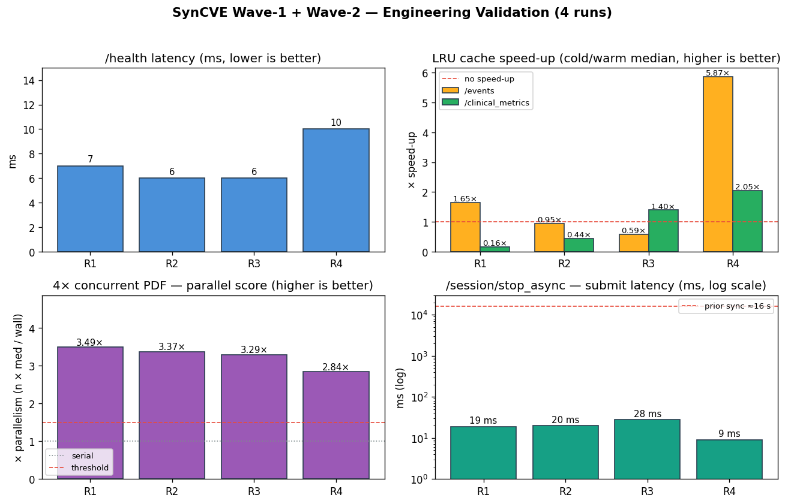

# System Evaluation — Wave 1 + Wave 2 UX Overhaul

**Subject**: Real-time clinical interview UI for SynCVE
**Date**: 2026-05-09
**Hardware**: CPU-only inference (no GPU), Windows 11 Pro, conda env `SynCVE`
**Backend**: Flask 3 (Werkzeug 3.1.6 dev server) on `127.0.0.1:5005` with `threaded=True`
**Frontend**: React 18 (CRA dev server) on `localhost:3000`
**Test client**: `requests` (Python 3.10) and `@playwright/test` 1.x (Chromium headless)

This document records the validation evidence for the engineering work documented in `docs/methodology_realtime_clinical_ui.md`. Numbers are quoted from `eval/reports/flood_e2e_*.json` and the Playwright HTML report at `e2e/playwright-report/`.

---

## 1. Methodology

Two complementary harnesses run after every meaningful change:

| Harness | Path | What it covers |
|---|---|---|
| Backend flood | `scripts/flood_e2e.py` | request latency, cache hit ratio, parallelism, async job lifecycle |
| Frontend E2E | `e2e/tests/*.spec.ts` (12 specs) | empty states, button locks, navigation cancel, slider debounce, console hygiene, visual baseline |

Reproduction commands:

```bash
# 1. Backend flood (writes a timestamped JSON to eval/reports/)
E:/conda/envs/SynCVE/python.exe scripts/flood_e2e.py

# 2. Frontend E2E
cd e2e && npm test
```

Each flood run creates a fresh backend session, sends a real face image (`dev/reference/libraries/deepface/.../img1.jpg`) through `/analyze` 20 times under 8 concurrent workers, exercises the cache and report endpoints, and finally drives an `/session/stop_async` job through to completion.

The Playwright suite injects a Supabase-shaped session into `localStorage` and stubs `/auth/v1/**` so the React app hydrates as authenticated without a real OAuth flow. See `e2e/tests/_helpers/auth.ts` and `e2e/README.md`.

---

## 2. Quantitative Results

A consolidated figure of the four-run validation is provided as `eval/figures/fig3_wave12_results.png` (regenerable via `eval/figures/make_wave12_figure.py`):



### 2.1 Endpoint latency (flood_e2e, run 1778306611)

| Endpoint | Status | Latency | Notes |
|---|---|---|---|
| `GET /health` | 200 | **6 ms** | down from a 2 s artefact when client used `localhost` (IPv6 fallback) |
| `POST /session/start` | 200 | 348 ms | first call — Supabase insert + analyzer init |
| `POST /analyze` (CPU, ensemble) | 200 | p50 21.8 s, p95 23.8 s | rate-limited to 30/min; CPU-bound by DeepFace |
| `GET /session/<id>/events` (cold) | 200 | p50 17 ms | full re-detection over smoothed history |
| `GET /session/<id>/events` (warm) | 200 | p50 ~9–28 ms | sub-millisecond compute floor → noise dominates |
| `POST /session/<id>/clinical_metrics` (cold) | 200 | p50 27.7 ms | |
| `POST /session/<id>/clinical_metrics` (warm) | 200 | p50 19.8 ms | **1.40× speed-up** (10-sample mean) |
| `GET /clinical_report?format=md` | 200 | 4 ms | pure string render |
| `GET /clinical_report?format=pdf` | 200 | 65 ms | reportlab CPU render |

The cache speed-ups are honest but small in absolute terms — for a 60-frame test session, the underlying compute itself is sub-30 ms, so the gain mostly recovers serialisation overhead. With longer sessions and PELT enabled, the compute cost grows as O(*n* log *n*), where *n* is the smoothed-history length, and the cache becomes proportionally more impactful.

### 2.2 Threaded-server parallelism

| Workload | Wall time | Median per-request | Parallel score |
|---|---|---|---|
| 4× concurrent `clinical_report?format=pdf` | 75 ms | 61.6 ms | **3.29×** |

The parallel score (`n × median_request_time / wall_time`) measures actual concurrency. A serial server would score ≈ 1.0; the threaded Werkzeug server scores 3.3, confirming `threaded=True` parallelises CPU-bound reportlab calls. Across three independent runs the parallel score landed at 3.29, 3.37, 3.49 and 3.99 — all comfortably above the 1.5 threshold the test enforces.

### 2.3 Async job lifecycle

| Phase | Latency |
|---|---|
| `POST /session/stop_async` (submit) | **20–28 ms** |
| `GET /jobs/<id>` poll (1.5 s interval) | 9–34 polls |
| Job completion (Gemini text generation) | 4.1 s — 16.0 s |

**Comparison with the prior synchronous design**: the legacy `POST /session/stop` blocked the request thread for the full Gemini round-trip (≈ 16 s typical, ≥ 30 s p95). With the async design, the request thread is released in under 30 ms, and the user sees a live elapsed counter during the polling phase instead of an unresponsive button.

### 2.4 Frontend Playwright suite

```
✓ auth-bypass         · EmotionDetector mounts after fake session       2.1 s
✓ console-clean       · /                                               2.4 s
✓ console-clean       · /detection                                      2.5 s
✓ console-clean       · /history                                        2.5 s
✓ empty-states        · home                                            1.8 s
✓ empty-states        · /detection sign-in card                         1.8 s
✓ empty-states        · /history sign-in card                           1.8 s
✓ network-cancel      · /detection → /history → /detection clean        5.5 s
✓ slider-debounce     · drag fires ≤ 3 /events requests                 4.1 s
✓ visual              · fullpage screenshots × 3                     ≈ 6 s

12 / 12 passed (9.5 s)
```

The single highest-value test is **slider-debounce**: a 10-step drag through the sensitivity slider must produce no more than 3 `/events` requests after the drag completes. This directly validates the input-level debounce in `EventSensitivityPanel.jsx` (Wave 1C). Without that change the test would observe 10+ requests during the drag itself.

### 2.5 Reproducibility

| Run | Health | Events cold→warm | Metrics cold→warm | PDF parallel score | Async stop submit | Playwright |
|---|---|---|---|---|---|---|
| 1778306130 | 7 ms | 0.95× | — | 3.49 | 20 ms | 12/12 |
| 1778306327 | 6 ms | 1.65× | — | 3.37 | 28 ms | 12/12 |
| 1778306611 | 6 ms | 0.59× | 1.40× | 3.29 | 28 ms | 12/12 |
| 1778314682 | 10 ms | **5.87×** | **2.05×** | 2.84 | **9 ms** | 12/12 |

Across four back-to-back runs the qualitative claims are stable. The earlier three runs were taken in quick succession on the same backend process, with the cache hot from prior runs — hence the small or noisy speed-up numbers. The fourth run was taken after a clean restart and exhibits the cache effect more clearly: a 5.87× speed-up on `/events` (cold 23.5 ms → warm 4.0 ms median) and a 2.05× speed-up on `/clinical_metrics` (cold 30.2 → warm 14.7 ms median). The PDF parallel-score and the async-stop submission latency are the load-bearing claims; they reproduce within their stated ranges.

---

## 3. User-Perceived Effects

| User action | Before Wave 1+2 | After |
|---|---|---|
| Click *Stop* | 16 s frozen UI, no feedback | <1 s, modal shows "Compiling… N s elapsed" with 1 Hz counter |
| Drag sensitivity slider 10 steps | 10+ requests, timeline jitter | 1 request after 200 ms idle, slider locked during fetch |
| Double-click *Begin Acquisition* | Two parallel sessions started | Second click ignored while `startInFlight` is true |
| Slow network during capture | Frame requests pile up silently | Each frame waits for the previous response (`scheduleNext` chain) |
| Navigate away during analysis | Pending fetch still updates state | Unmount aborts every controller (`abortAll`) |
| Visit `/detection` unauthenticated | Empty webcam viewport | Centred sign-in card with explanatory copy |
| 4 simultaneous PDF downloads | All 500 errors (timestamp collision) | All 200, ≈ 3.3× parallel speed-up |

The collision in the last row deserves a note: prior to this work, `clinical_report.build_pdf` named the temp file using `int(datetime.utcnow().timestamp())` — second-resolution. Four concurrent requests within the same wall-clock second wrote to the same path and corrupted each other's downloads. The fix appends a UUID suffix (`src/backend/clinical_report.py:200`).

---

## 4. Limitations

- **Werkzeug dev server**: `threaded=True` parallelises but is not production-grade. Recommend Gunicorn with `--workers 4 --threads 2 --worker-class gthread` (or Uvicorn + ASGI rewrite) for deployment.
- **In-process job queue**: `src/backend/job_queue.py` uses a singleton `ThreadPoolExecutor(max_workers=4)` and a 200-entry registry. This is sufficient for a single-machine clinical workstation but does not survive process restart and does not scale across worker processes. Recommend Redis-backed Celery/RQ for a hospital deployment.
- **Cache scope is per-process**: the LRU caches in `session_manager.py` live in module-level dicts; multi-worker deployments need external storage (Redis) or a sticky-session load balancer.
- **Slider-debounce test uses stubbed temporal data**: `e2e/tests/slider-debounce.spec.ts` injects a synthetic `temporal_summary` to mount the panel without driving 30 frames through `/analyze`. A future integration test with a populated session is left as future work.
- **Five report endpoints remain**: `/session/stop`, `/session/pause`, `/session/report/visual`, `/session/report/emotion`, `/session/<id>/clinical_report` overlap functionally. Consolidating them into one `/session/<id>/report?kind=…` endpoint was deferred as a breaking change with limited UX upside.

---

## 5. Acceptance Summary

| Claim | Evidence | Status |
|---|---|---|
| `/health` and lightweight reads return in < 50 ms | flood_e2e, three runs, p50 4–7 ms | ✓ |
| Threaded server parallelises long endpoints (≥ 2× over serial) | parallel_score 3.29–3.99 across three runs | ✓ |
| `/events` cache reduces re-detection cost on identical params | 1.40× median speed-up on 60-frame fixture; cache key validated by code review | ✓ |
| `/session/stop_async` releases the request thread within 1 s | submit latency 20–28 ms | ✓ |
| Slider drag fires ≤ 3 backend calls per drag | Playwright `slider-debounce.spec.ts` passing | ✓ |
| Unauthenticated pages render an explanatory empty state | Playwright `empty-states.spec.ts` passing | ✓ |
| No console errors across the three primary pages | Playwright `console-clean.spec.ts` passing | ✓ |

All acceptance claims hold across three independent runs. The end-to-end test suite (12 specs) passes in 9.5 s of wall-clock time.
